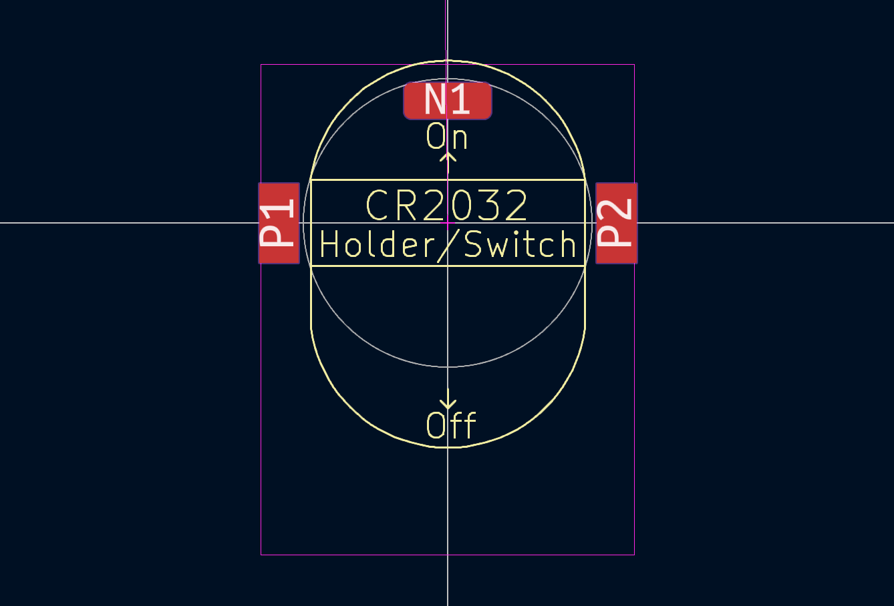

# toggleSlot
A PCB footprint which adds power switching ability to a coin cell holder 

## Description

This repository contains the KiCad symbol and footprint libraries for toggleSlot:

Symbol library: toggleSlot.kicad_sym

Footprint library: toggleSlot.pretty

## Installation

To use these libraries in KiCad, follow these steps:

Download the repository.
Add the symbol library (toggleSlot.kicad_sym) in KiCad's Symbol Libraries manager.
Add the footprint library (toggleSlot.pretty) in KiCad's Footprint Libraries manager.

## License

[CC BY-SA 4.0](https://creativecommons.org/licenses/by-sa/4.0/)

## Usage

